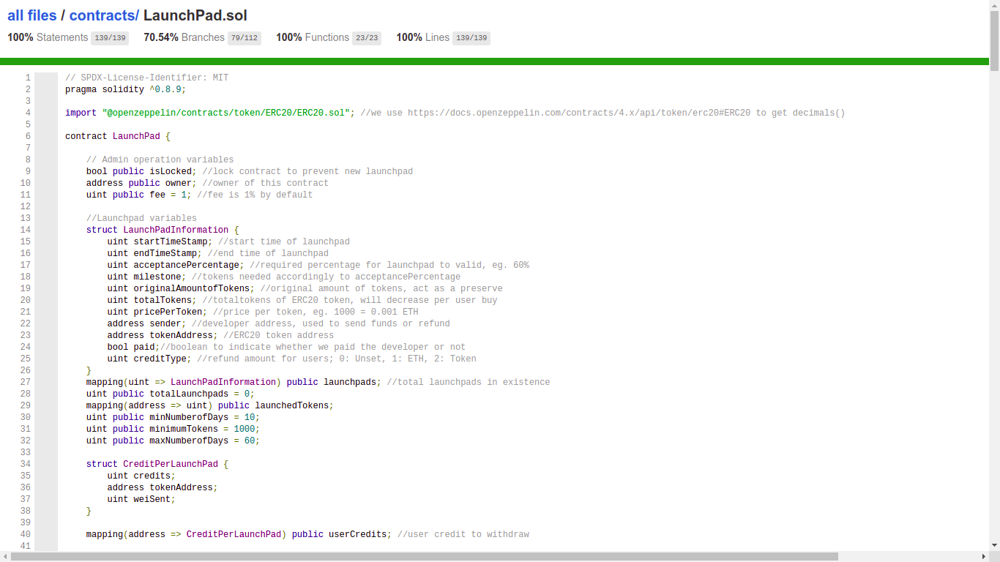

# BMIS2003 Blockchain Assignment


## GitHub COMMAND
1. git clone https://github.com/wow32/Blockchain-Assignment (get all the files)
2. code . (open visual code)
3. git add . (include all the files)
4. git commit -m "xxxx" (commit & add the message)
5. git push 

## Contracts

[LaunchPad.sol](contracts/LaunchPad.sol): deployed to [Ropsten testnet](https://ropsten.etherscan.io/address/0x709DAD9877dB6CecC065B0603E8F9761d631bE8A#code)

## Test files

- [launchpad.js](test/launchpad.js)
- [timeTravel.js](test/timeTravel.js)

## Coverage report

- [LaunchPad coverage report](coverage/contracts/LaunchPad.sol.html)

#### Example coverage report


## Testing in Remix IDE
1. Deploy Launchpad
1. Deploy custom ERC20 token
2. Approve or increase allowance for launchpad to spend, [front-end need to handle this](https://ethereum.stackexchange.com/a/112191)
3. Run `launchMyToken` function with desired input, optionally run `estimateProtocolFee` to estimate required fee.
4. User purchase via `buyLaunchPadToken`, optionally run `retrievePriceForToken` or `getMaxBuyValueForToken` beforehand to estimate price.
5. Run `settleLaunchPad` to finish the launchpad
6. User run `withdrawCredits` to withdraw funds, either ETH or custom tokens

## Protocol Fees
The protocol will take a small percentage of fees from the developers in order to operate the system and eat bread.
``` solidity
feeToPaid = totalTokens * protocolFeePercentage * ethUnit
```
- `totalTokens`: Total amount of tokens developer wants to launch, eg. `1000`
- `protocolFeePercentage`: Service fee taken by protocol, eg. `1%`
- `ethUnit`: ETH is denominated by Wei and doesn't support decimals, we will be using `0.001 ETH`, eg. `10 ** 16`

Example:
```solidity
 function calculate() public pure returns (uint) {
        // Formula: totalTokens * protocolFeePercentage * ethUnit
        uint _totalTokens = 1000; // 1000 tokens to launch
        uint _protocolFeePercentage = 1; // 1%
        uint _ethUnit = 10 ** 16; // 0.001 ETH

        uint feePercentage = (_totalTokens * _protocolFeePercentage) / 100; //multiply before division
        uint feeToPaid = feePercentage * _ethUnit;
        return feeToPaid; //returns 100000000000000000 Wei = 0.1 ETH, source: https://eth-converter.com/
    }
```
The above example shows that the developer is required to deposit 0.1 ETH as protocol fees when attempting to launch 1000 tokens to the launchpad set at 1%.


## Installation and Truffle testing
> The following setup is tested in Linux, Windows user should modify the configuration accordingly

#### Clone the GitHub repository

```
git clone https://github.com/wow32/Blockchain-Assignment
```

#### Compile all contracts
```
truffle compile
```

#### Start local development node in new terminal
```
ganache-cli
```
#### Install Openzeppelin test helpers
```
npm install --save-dev @openzeppelin/test-helpers
```

#### Run test files
```
truffle test
truffle test --show-events 
```

#### Check test coverage
```
npm install -g --save-dev solidity-coverage
truffle run coverage
```

## Testnet deployment
1. Install HD Wallet
```
npm install @truffle/hdwallet-provider
```

2. Create .env file and fill up required values
```
ROPSTEN_RPC_URL=wss://ropsten.infura.io/ws/v3/VALUE
MNEMONIC="VALUE"
ETHERSCANAPIKEY=VALUE
```

3. Compile contract
```
truffle compile
```

4. Fund some ETH from faucets for gas fees

5. Deploy to Ropsten testnet
```
truffle migrate --network ropsten
```

## Contract verification
- [Verified contract on Ropsten testnet](https://ropsten.etherscan.io/address/0x709DAD9877dB6CecC065B0603E8F9761d631bE8A#code)
- Automatic verification using [truffle-plugin-verify](https://www.npmjs.com/package/truffle-plugin-verify)

## Work Flow (legacy)
1. Developer deposit tokens 
- Handle max capacity
- Handle time to start and end
- Percentage of acceptance (eg. 60%)

2. User participate in crowd sale
- Record user purchase in credits
- Check if sale already started and ended already
- Only accept ETH

3. After sales
- Check percentage, if not satisfy send tokens back to developer 
- Pull over push method to let user withdraw
- Refund left crypto to developer (if have)

4. Admin functions
- Withdraw all funds
- Lock contract 
- Update admin 

5. Front end design
- web3 js integration

## Future improvements
1. Allowing developer to launch token address more than one time
2. Use other funds instead of ETH
3. Dynamic calculation system
4. Gas optimization
5. Vesting 
6. Protocol token for platform launch
7. Use Solidity's latest compiler feature (eg. custom error)

## TODO:
- [x] Fee calculations
- [x] Events should be emitted
- [x] Public getters
- [x] Price per token
- [x] Test cases to make sure everything works as expected
- [x] Limit to 18 decimals
- [x] Map credit to multiple launchpad id
- [x] Refactor code for readability
- [x] Getters for minimum and maximum price per token
- [x] Testnet deployment and testing
- [x] Contract verification
- [ ] Finalize README

## References
1. https://eth-converter.com/
2. https://docs.openzeppelin.com/contracts/4.x/api/token/erc20#ERC20
3. https://blog.colony.io/code-coverage-for-solidity-eecfa88668c2/
4. https://kalis.me/verify-truffle-smart-contracts-etherscan/
5. https://forum.openzeppelin.com/t/how-to-verify-with-hardhat-or-truffle-a-smart-contract-using-openzeppelin-contracts/4119
